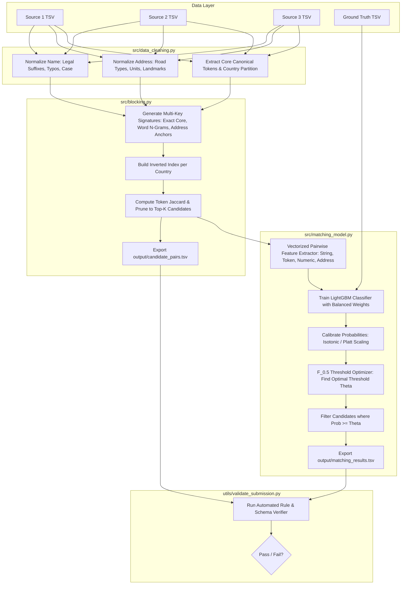

# System Architecture: Amazon ML Challenge 2026

## 1. Technology Stack
The pipeline is constructed in Python using industry-standard scientific, data engineering, and machine learning libraries:

| Layer | Technology | Version | Purpose / Responsibilities |
|---|---|---|---|
| **Runtime Environment** | Python | `>= 3.10, < 3.12` | Core programming language; robust type hinting support. |
| **Data Ingestion & Tabular I/O** | Pandas | `>= 2.0.0` | High-throughput TSV data loading, tabular manipulations, fast chunked serialization. |
| **Numerical Processing** | NumPy | `>= 1.24.0` | Vectorized array operations, linear algebra, memory-efficient boolean masks. |
| **Classical ML & Metrics** | Scikit-learn | `>= 1.3.0` | Cross-validation partitioning, TF-IDF vectorization, evaluation metrics, probability calibration. |
| **Primary Classifier** | LightGBM | `>= 4.0.0` | Ultra-fast gradient boosting on sparse pairwise features, native handling of missing values, low memory consumption. |
| **Secondary Classifier** | XGBoost | `>= 2.0.0` | Ensembling and benchmarking gradient boosted decision trees (`tree_method='hist'`). |
| **String Similarity & Levenshtein**| RapidFuzz / Difflib | Standard / Latest | C-accelerated Levenshtein, Jaro-Winkler, token sort/set ratio algorithms. |
| **System Validation** | Python Standard Library | Standard | Standalone format and integrity validation (`utils/validate_submission.py`). |

---

## 2. Directory & Repository Structure

```text
Amazon ML Challenge 2026/
│
├── context/                                # Foundational Project Context System
│   ├── project_overview.md                 # Product scope, problem definition, F_0.5 metric
│   ├── architecture.md                     # System architecture, boundaries, data flow
│   ├── build_plan.md                       # Phased development roadmap and milestones
│   ├── code_standards.md                   # Python conventions, vectorization, memory rules
│   ├── library_docs.md                     # Library usage patterns and best practices
│   ├── data_dictionary.md                  # Data schemas, noise patterns, country specifics
│   ├── feature_and_model_rules.md          # ER rules, blocking keys, feature formulas, thresholding
│   ├── experiment_registry.md              # Living experiment and benchmark tracker
│   └── progress_tracker.md                 # Living progress checklist
│
├── dataset/                                # Datasets (Read-Only / Never Mutate)
│   ├── train/
│   │   ├── train_source1.tsv               # Source 1 training records (~deduplicated reference)
│   │   ├── train_source2.tsv               # Source 2 training records
│   │   ├── train_source3.tsv               # Source 3 training records
│   │   └── train_ground_truth.tsv          # Ground truth pairs for S1
│   │
│   └── test/
│       ├── test_source1.tsv                # Source 1 test records (Every S1 ID must be in output)
│       ├── test_source2.tsv                # Source 2 test records
│       └── test_source3.tsv                # Source 3 test records (Includes France records)
│
├── src/                                    # Pipeline Source Modules
│   ├── __init__.py                         # Python package initializer
│   ├── data_inspection.py                  # Step 1: Health audit, duplicate checks, null analysis
│   ├── data_cleaning.py                    # Step 2: Vectorized text cleaning & canonical normalization
│   ├── blocking.py                         # Step 3: Multi-key inverted index candidate generation
│   └── matching_model.py                   # Step 4: Pairwise feature extraction, LightGBM, F_0.5 tuning
│
├── utils/                                  # Utility Tools & Validation
│   └── validate_submission.py              # Official format & schema compliance validator
│
├── output/                                 # Generated Artifacts (Ignored by Git)
│   ├── candidate_pairs.tsv                 # Blocking candidate set fed to model
│   └── matching_results.tsv                # Final predicted matches for leaderboard
│
├── agents.md                               # Master Instruction Manual for AI Agents
├── Documentation_template.md               # Contest methodology write-up template
├── README.md                               # Project documentation and execution instructions
├── requirements.txt                        # Pinned environment dependencies
└── .gitignore                              # Git exclusion rules for large datasets and outputs
```

---

## 3. Strict System & Data Boundaries

### A. Immutability of Raw Data (`dataset/`)
- Under no circumstance may any script overwrite, modify, append to, or reformat files within `dataset/train/` or `dataset/test/`.
- All processed representations (cleaned caches, candidate indices, feature matrices) must be retained in memory, generated via streaming, or written to temporary/output directories.

### B. Country Partitioning Invariant (Zero Cross-Country Bleed)
- Physical real-world business entities exist within a specific geographic sovereignty.
- Records with `country == 'US'` are strictly blocked and compared only against candidate targets with `country == 'US'`.
- Records with `country == 'IN'` (India) are strictly blocked against `country == 'IN'`.
- Records with `country == 'FR'` (France) are strictly blocked against `country == 'FR'`.
- Comparing across countries yields a prior match probability of $\approx 0$ while ballooning candidate space by $3\times$. This invariant is strictly enforced at the blocking stage.

### C. Source Matching Topology
- Comparisons are strictly directed: $S_1 \times (S_2 \cup S_3)$.
- **Forbidden**:
  - $S_1 \times S_1$ (Self-matching within reference source is invalid).
  - $S_2 \times S_2$ or $S_3 \times S_3$ or $S_2 \times S_3$ (Secondary source cross-matching is out of scope).

### D. Candidate-to-Prediction Subset Invariant
- Every entity ID appearing in `output/matching_results.tsv` for a given $S_1$ record **must** exist in `output/candidate_pairs.tsv` for that same $S_1$ record.
- A match that bypasses candidate generation indicates an illegal pipeline discrepancy and triggers validator warnings.

---

## 4. Pipeline Component Architecture



---

## 5. Memory & Scalability Engineering Rules
With $\sim 1.73$ million Source 1 records and $\sim 10$ million records across Source 2 and Source 3:

1. **Inverted Index Representation**:
   Inverted index postings lists store integer row offsets or compact integer indices, not duplicate strings or full records.
2. **Streaming Chunk Processing**:
   When parsing test sets, use chunked streaming (`pd.read_csv(..., chunksize=100000, sep='\t')`) to prevent out-of-memory (OOM) crashes on standard developer machines.
3. **Candidate Budget ($K$)**:
   Candidate generation must enforce a maximum candidate cap ($K \in [15, 30]$) per $S_1$ entity. Capping candidates guarantees a strict upper bound of $O(K \cdot N_{S_1})$ pairwise evaluations rather than $O(N_{S_1} \cdot N_{S_{2,3}})$.
4. **Garbage Collection**:
   Explicitly delete intermediate data structures (`del large_df`) and trigger `gc.collect()` before transitioning between blocking and feature extraction.
